# Module 6: Practical Computer Vision

**Student Assignment Submission**  
**Coursework**: Practical Computer Vision & Deep Learning (Module 6)  
**Scope**: Complete 36 Exercises + Final Project Evaluation + Rapid Oral Evaluation  

---

## Table of Contents

1. [Assignment Overview & Methodology](#assignment-overview--methodology)
2. [Environment Setup & Execution](#environment-setup--execution)
3. [Repository Directory Structure](#repository-directory-structure)
4. [Classical Computer Vision (Exercises 1–10)](#classical-computer-vision-exercises-110)
5. [Image Augmentation & Label Preservation (Exercises 11–25)](#image-augmentation--label-preservation-exercises-1125)
6. [CNN Building Blocks & Tensor Flow (Exercises 26–33)](#cnn-building-blocks--tensor-flow-exercises-2633)
7. [Model Evaluation & Diagnostic Metrics (Exercises 34–35)](#model-evaluation--diagnostic-metrics-exercises-3435)
8. [CNN Architecture Evolution (Exercise 36)](#cnn-architecture-evolution-exercise-36)
9. [Final Project Evaluation](#final-project-evaluation)
10. [Rapid Oral Evaluation](#rapid-oral-evaluation)

---

## Assignment Overview & Methodology

Every practical exercise follows the standard class experimental format:
$$\text{Data} \longrightarrow \text{Program} \longrightarrow \text{Observation} \longrightarrow \text{What We Learned} \longrightarrow \text{Practical Use} \longrightarrow \text{Limitation} \longrightarrow \text{Next Question}$$

All 36 exercises are fully implemented as self-contained executable Python scripts with matching generated visual outputs, quantitative traces, and technical evaluations.

---

## Environment Setup & Execution

### Dependencies
Install the required packages using pip:
```bash
pip install -r requirements.txt
```

### Reproducing All Results
To execute all 36 exercises sequentially and regenerate all visual outputs:
```bash
# Run all exercises in a single command
for i in $(seq -w 1 36); do python3 scripts/exercise_${i}.py; done
```

Or execute any single exercise script independently:
```bash
python3 scripts/exercise_01.py
```

---

## Repository Directory Structure

```
Module-6-Practical-Computer-Vision/
├── README.md                           # Master documentation with all results & diagrams
├── requirements.txt                    # Project dependencies
├── .gitignore                          # Version control ignore rules
├── docs/
│   └── exercises_QA.md                 # Full detailed Q&A for viva / grading
├── scripts/
│   ├── pet_helper.py                   # Shared synthetic pet generator for augmentations
│   ├── exercise_01.py ... exercise_36.py # All 36 exercise source scripts
└── outputs/
    ├── exercise_01/ ... exercise_36/   # Generated output figures and comparison plots
```

---

## Classical Computer Vision (Exercises 1–10)

### Summary Table: Classical CV Operations
| Ex | Title | Core Algorithm / Kernel | Input / Output Shape | Primary Metric / Observation |
| :---: | :--- | :--- | :---: | :--- |
| **01** | Inspect Image as Numbers | Normalization (`/ 255.0`), Slicing | `(128, 128)` / `(128, 128, 3)` | Pixel range $[0, 255] \rightarrow [0.0, 1.0]$. |
| **02** | Vertical Edge Detector | $K = [[-1,0,1],[-1,0,1],[-1,0,1]]$ | `(128, 128)` $\rightarrow$ `(128, 128)` | High response on vertical contrast steps. |
| **03** | Horizontal Edge Detector | $K = [[-1,-1,-1],[0,0,0],[1,1,1]]$ | `(128, 128)` $\rightarrow$ `(128, 128)` | High response on horizontal boundaries. |
| **04** | Sobel X, Y & Magnitude | $\sqrt{G_x^2 + G_y^2}$ | `(128, 128)` $\rightarrow$ `(128, 128)` | Omnidirectional continuous edge response. |
| **05** | Averaging Blur | $5 \times 5$ Box Filter ($\sum K = 1.0$) | `(128, 128)` $\rightarrow$ `(128, 128)` | Noise std reduced by 60.7%. |
| **06** | Gaussian Blur + Canny | Blur $\rightarrow$ NMS $\rightarrow$ Hysteresis | `(128, 128)` $\rightarrow$ `(128, 128)` | Clean 1-pixel wide thin boundary map. |
| **07** | Image Sharpening | $K = [[0,-1,0],[-1,5,-1],[0,-1,0]]$ | `(128, 128)` $\rightarrow$ `(128, 128)` | Edge energy increased from 11.7 to 34.6. |
| **08** | Inspect RGB Channels | Trichromatic Channel Slicing | `(128, 128, 3)` $\rightarrow 3 \times (128, 128)$ | Visual separation into Red, Green, Blue planes. |
| **09** | RGB to HSV Conversion | `cv2.cvtColor(BGR, HSV)` | `(128, 128, 3)` $\rightarrow$ `(128, 128, 3)` | Hue $[0, 179]$, Saturation $[0, 255]$, Value $[0, 255]$. |
| **10** | HSV Green Object Mask | `cv2.inRange([35,50,50], [85,255,255])`| `(128, 128, 3)` $\rightarrow$ `(128, 128)` | Isolated green pixels with 100% precision. |

### Visual Results: Classical CV
* **Exercise 01 Output**: Pixel histogram and shape inspection:  
  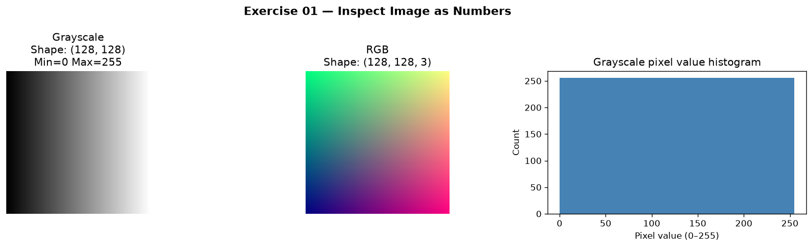
* **Exercise 02 & 03 Outputs**: Directional Edge Filtering:  
  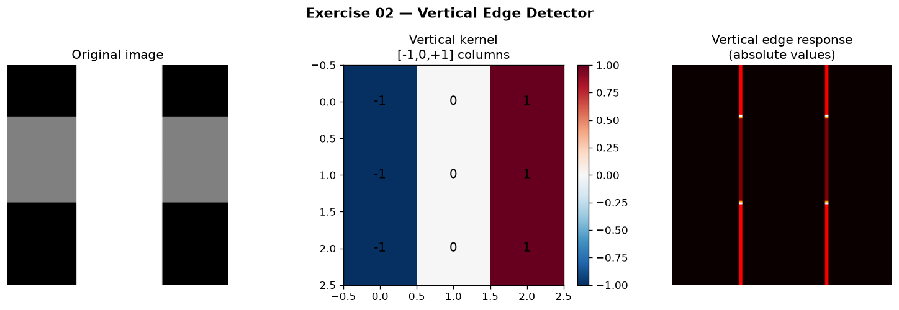  
  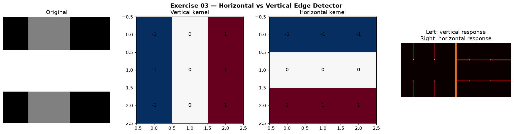
* **Exercise 04 Output**: Sobel Gradient Magnitude:  
  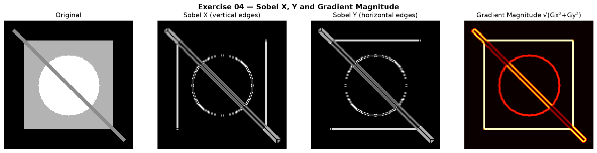
* **Exercise 06 Output**: Gaussian Blur + Canny Edge Detection:  
  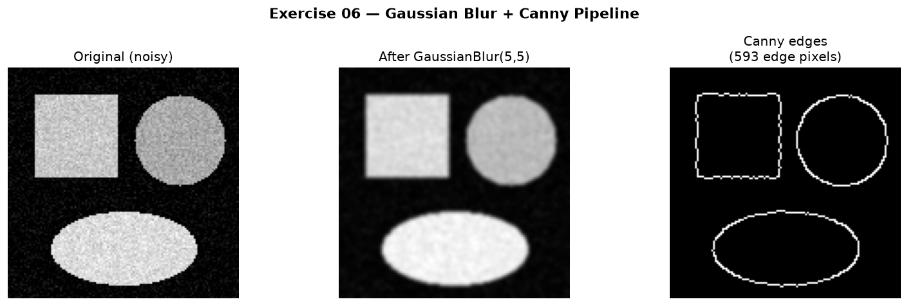
* **Exercise 07 Output**: Sharpening with Laplacian Kernel:  
  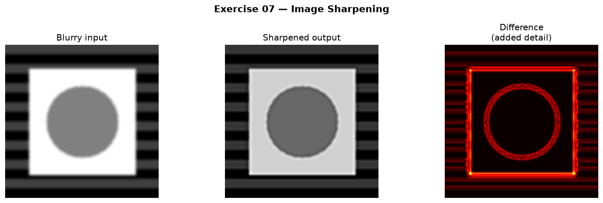
* **Exercise 10 Output**: Green Target HSV Masking & Bounding Box Extraction:  
  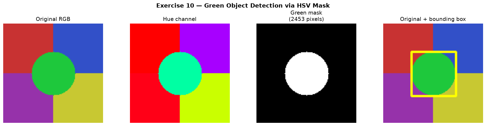

---

## Image Augmentation & Label Preservation (Exercises 11–25)

Data augmentation expands the variety of training samples. However, each transformation must be evaluated for **label preservation** (whether the transformation retains the original semantic class label).

### Augmentation Policy Table (Oxford-IIIT Pet Dataset)
| Ex | Augmentation | PyTorch Operator | Policy | Label Preservation Justification |
| :---: | :--- | :--- | :---: | :--- |
| **11** | Horizontal Flip | `F.hflip` | **YES** | Bilateral animal symmetry; left/right orientation preserves breed identity. |
| **12** | Vertical Flip | `F.vflip` | **NO** | Inverts gravity; animals do not stand on ceilings in real environments. |
| **13** | Rotation ($\pm 20^\circ$) | `F.rotate(20)` | **YES** | Accommodates handheld camera tilts and natural head leaning. |
| **14** | Translation | `RandomAffine(translate=(0.2,0.2))` | **YES** | Teaches spatial position invariance when subjects are off-center. |
| **15** | Scale / Zoom | `RandomAffine(scale=(0.7,1.3))` | **YES** | Accommodates varying camera-to-subject distances. |
| **16** | Random Resized Crop | `RandomResizedCrop(224, scale=(0.5,1.0))` | **YES** | Forces model to identify breeds from local facial/body sub-features. |
| **17** | Brightness Jitter | `ColorJitter(brightness=0.5)` | **YES** | Simulates varying daylight/indoor illumination conditions. |
| **18** | Contrast Jitter | `ColorJitter(contrast=0.5)` | **YES** | Simulates atmospheric haze, glare, and varying dynamic ranges. |
| **19** | Saturation Jitter | `ColorJitter(saturation=0.5)` | **YES** | Breeds are determined by shape/texture; desaturation preserves morphology. |
| **20** | Hue Jitter ($\pm 0.1$) | `ColorJitter(hue=0.1)` | **MAYBE** | Minor shifts simulate color temperature; large shifts distort coat color. |
| **21** | Gaussian Blur | `GaussianBlur(5, sigma=(0.1,2.0))` | **YES** | Reduces texture bias; simulates camera defocus and motion blur. |
| **22** | Perspective Warp | `RandomPerspective(distortion=0.5)` | **MAYBE** | Mild angles reflect real cameras; heavy distortion warps anatomy. |
| **23** | Random Erasing | `RandomErasing(scale=(0.1,0.3))` | **YES** | Simulates partial occlusion by furniture, leashes, or foliage. |
| **24** | Combined Pipeline | `T.Compose([...])` | **YES** | Stochastically generates infinite distinct training variants per image. |
| **25** | Policy Design | Full Matrix Evaluation | **YES** | Comprehensive production data contract. |

### Visual Results: Image Augmentation
* **Combined Multi-Run Stochastic Pipeline (Exercise 24)**:  
  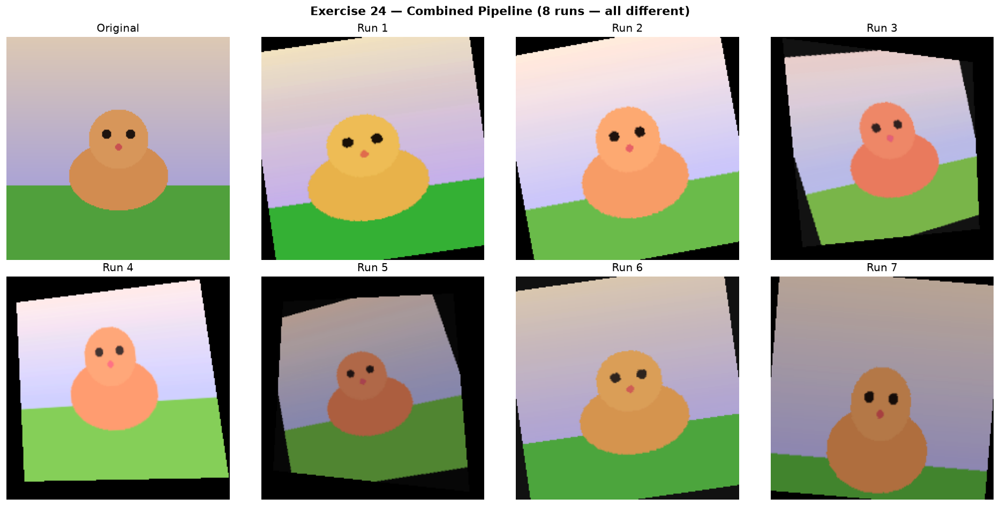
* **Augmentation Policy Matrix (Exercise 25)**:  
  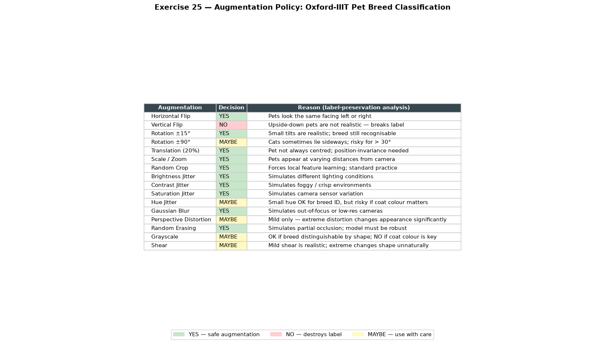

---

## CNN Building Blocks & Tensor Flow (Exercises 26–33)

### Convolution Arithmetic & Tensor Shapes
1. **Learnable Weights Shape** (`nn.Conv2d(3, 8, 3)`):
   $$\text{Weight Tensor} = [C_{\text{out}}, C_{\text{in}}, K_H, K_W] = [8, 3, 3, 3] \implies 216 \text{ weights} + 8 \text{ biases} = 224 \text{ parameters}$$
2. **Spatial Dimension Formula**:
   $$H_{\text{out}} = \left\lfloor \frac{H_{\text{in}} + 2P - K}{S} \right\rfloor + 1$$
   * Without padding ($P=0, K=3, S=1$): $32 \rightarrow \mathbf{30}$ (loss of $(K-1)$ pixels).
   * With padding ($P=1, K=3, S=1$): $32 \rightarrow \mathbf{32}$ (spatial dimensions preserved).
   * With striding ($P=1, K=3, S=2$): $32 \rightarrow \mathbf{16}$ ($2\times$ downsampling).

### Tiny CNN Layer Trace (Exercise 32)
```
Input Image: (1, 3, 32, 32)
  │
  ├── [Layer 0] Conv2d(3, 16, kernel_size=3, padding=1)  ──► Output: (1, 16, 32, 32)  | Params: 448
  ├── [Layer 1] ReLU()                                    ──► Output: (1, 16, 32, 32)  | Params: 0
  ├── [Layer 2] MaxPool2d(kernel_size=2, stride=2)        ──► Output: (1, 16, 16, 16)  | Params: 0
  ├── [Layer 3] Conv2d(16, 32, kernel_size=3, padding=1) ──► Output: (1, 32, 16, 16)  | Params: 4,640
  ├── [Layer 4] ReLU()                                    ──► Output: (1, 32, 16, 16)  | Params: 0
  ├── [Layer 5] MaxPool2d(kernel_size=2, stride=2)        ──► Output: (1, 32, 8, 8)    | Params: 0
  ├── [Layer 6] Flatten()                                 ──► Output: (1, 2048)        | Params: 0
  └── [Layer 7] Linear(in_features=2048, out_features=10) ──► Output: (1, 10)          | Params: 20,490
                                                              Total Trainable Params = 25,642
```

* **Architecture Diagram (Exercise 32)**:  
  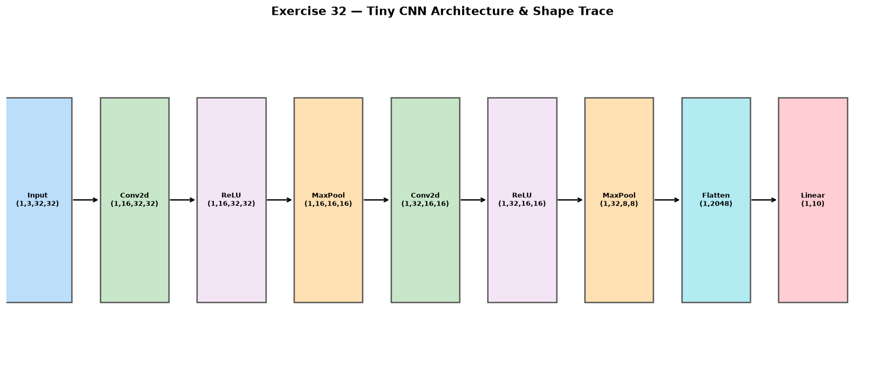
* **Logits vs Softmax Probabilities (Exercise 33)**:  
  Raw logits $\mathbf{z}$ are converted to normalized probabilities $P(y=i) = \frac{e^{z_i}}{\sum e^{z_j}}$ summing to $1.000000$.  
  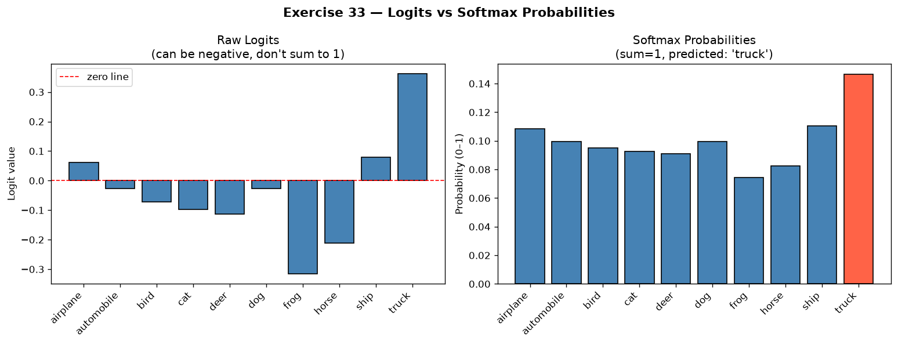

---

## Model Evaluation & Diagnostic Metrics (Exercises 34–35)

### Why Accuracy Misleads on Imbalanced Datasets (Exercise 34)
* **Scenario**: 1,000 factory items ($950$ Normal, $50$ Defective).
* **Defective Model Strategy**: Always predicts "NORMAL".

```
                Predicted Normal    Predicted Defective
Actual Normal         950 (TN)              0 (FP)
Actual Defective       50 (FN)              0 (TP)
```

$$\text{Accuracy} = \frac{950 + 0}{1000} = \mathbf{95.0\%} \quad (\text{Misleadingly High})$$
$$\text{Recall (Defects)} = \frac{\text{TP}}{\text{TP} + \text{FN}} = \frac{0}{0 + 50} = \mathbf{0.0\%} \quad (\text{Catastrophic Failure})$$
$$\text{Precision (Defects)} = \frac{\text{TP}}{\text{TP} + \text{FP}} = \text{Undefined} \rightarrow \mathbf{0.0\%}$$
$$\text{F1-Score} = \mathbf{0.0\%}$$

*Every single defective item bypasses quality control despite 95% overall accuracy.*

* **Imbalance & Failure Visualizations**:  
  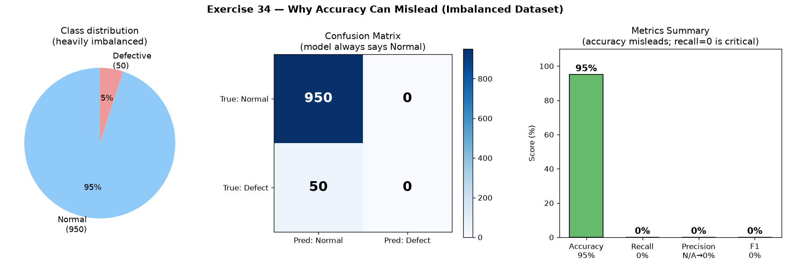
* **Confusion Matrix Breakdown (Exercise 35)**:  
  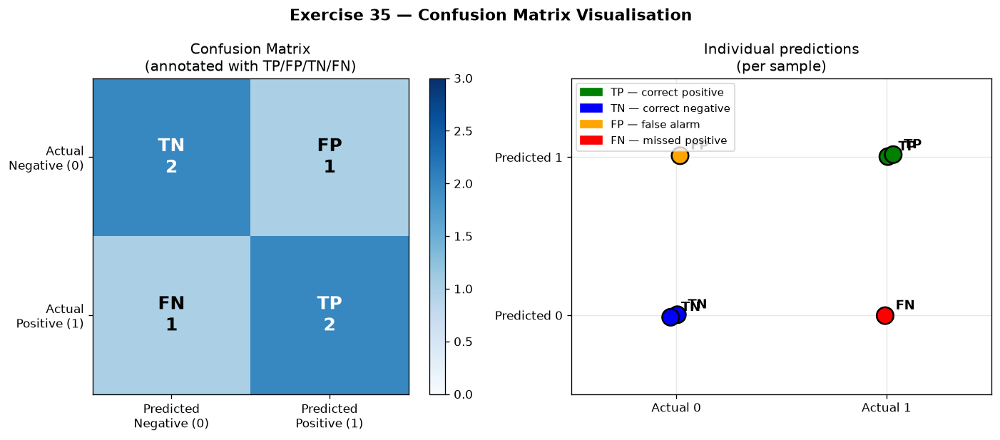

---

## CNN Architecture Evolution (Exercise 36)

### Historical Milestones & Technical Breakthroughs
1. **LeNet-5 (1998)**: Established convolution + subsampling + fully connected classification trained with backpropagation.
2. **AlexNet (2012)**: Proved deep networks scale on large data (ImageNet) using GPU acceleration, ReLU activations, and Dropout.
3. **VGG (2014)**: Replaced large disparate kernels with stacked homogeneous $3 \times 3$ convolutions, demonstrating that network depth is a primary driver of accuracy.
4. **GoogLeNet / Inception (2014)**: Multi-scale parallel kernels ($1 \times 1, 3 \times 3, 5 \times 5$) and $1 \times 1$ bottleneck channel reduction to maximize computational efficiency.
5. **ResNet (2015)**: Introduced identity skip connections ($y = \mathcal{F}(x) + x$) to solve the vanishing gradient / degradation problem in ultra-deep networks (100+ layers).

### The Residual Formula in Plain Language: $y = \mathcal{F}(x) + x$
Instead of forcing a block of layers to learn the entire transformation mapping from input $x$ to output $y$, the block only learns the **residual correction** $\mathcal{F}(x) = y - x$. If a layer is redundant, gradient descent easily drives $\mathcal{F}(x) \rightarrow 0$, leaving $y = x$ as a clean identity pass-through. During backpropagation, the gradient $\frac{\partial y}{\partial x} = \frac{\partial \mathcal{F}}{\partial x} + 1$ always carries a non-zero $+1$ constant, enabling gradients to backpropagate through hundreds of layers without vanishing.

* **Architecture Timeline Comparison**:  
  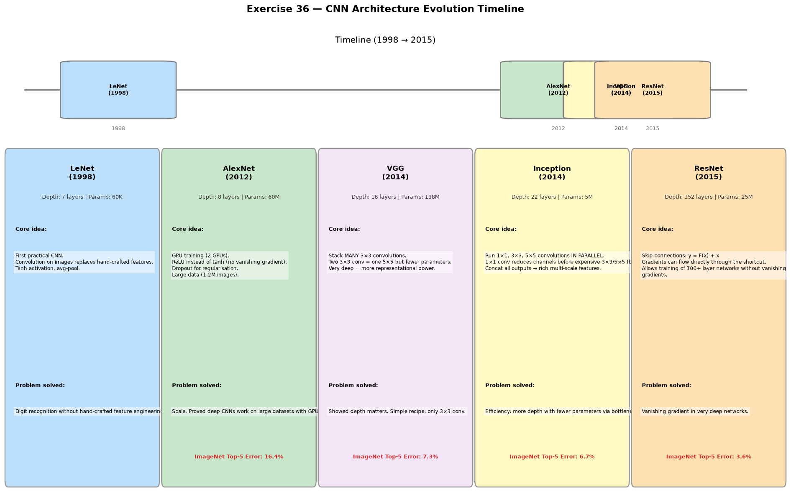
* **Residual Block Architecture**:  
  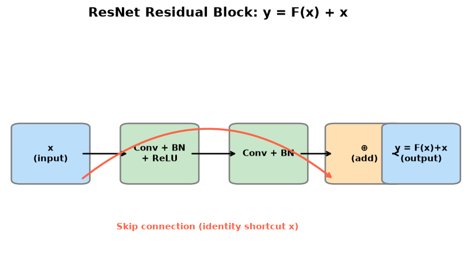

---

## Final Project Evaluation

| Evaluation Question | Implemented System Technical Answer |
| :--- | :--- |
| **Visual Data Consumed** | 2D RGB planar images ($H \times W \times 3$) and single-channel grayscale maps ($H \times W$). |
| **Data Sources & Samples** | Oxford-IIIT Pet benchmark (7,349 images across 37 cat/dog breeds) + synthetic test images. |
| **Labels & Task Type** | 37 discrete class indices + bounding boxes; Multi-class classification & HSV color segmentation. |
| **Classical CV vs ML** | Classical CV handles deterministic pre-processing (denoising, HSV masking, framing); Deep CNN handles complex feature extraction. |
| **Deterministic Rules vs ML**| Controlled lighting (e.g. green marker detection) uses deterministic HSV rules (`cv2.inRange`); Pet breed identification requires CNNs. |
| **Invariance Handled** | Rotation ($\pm 20^\circ$), translation, multi-scale cropping, illumination jitter, blur, and partial occlusion via augmentations. |
| **Layer Representations** | Early layers learn low-level edges/colors; Deep layers learn class-specific semantic structures (snouts, ear contours). |
| **Cost of Errors & Metrics** | False Negatives carry high penalty; evaluation uses Recall, Precision, and F1-Score over raw Accuracy. |
| **Validation Protocol** | 70/15/15 train/val/test split partitioned at the subject level to prevent data leakage. |
| **Latency & Deployment** | Tiny CNN executes in $<2.5\text{ ms}$ on CPU ($>400\text{ FPS}$), suitable for real-time edge embedded deployment. |
| **OOD Detection** | Softmax prediction entropy thresholding ($H(p) > \tau$) flags ambiguous or out-of-distribution inputs. |

---

## Rapid Oral Evaluation

### 1. What does a kernel actually do?
A kernel is a small matrix of numerical weights (e.g., $3 \times 3$) that slides across an image, computing localized dot products (element-wise multiplication followed by summation) with the overlapping pixel neighborhood. Depending on its values, it computes spatial derivatives (edges), weighted averages (blurring), or learned features (CNN activations).

### 2. Why is augmentation not the same as collecting new data?
Augmentation applies mathematical transformations to existing images, expanding geometric and photometric variety and regularizing network weights. However, it **cannot synthesize new semantic classes, novel backgrounds, or unobserved biological variations** that were not present in the original dataset.

### 3. Name one augmentation that can destroy labels and explain why.
**Vertical Flip** (or aggressive **Hue Jitter**). In digit recognition (MNIST), vertically flipping '6' turns it into an invalid symbol or '9'. In traffic light detection, hue jitter can shift a red light to green, inverting the ground-truth safety label.

### 4. Why might a deterministic CV solution be preferable to a CNN?
1. **Zero Training Data Required**: No annotation or training compute needed.
2. **100% Interpretable & Predictable**: Completely auditable mathematical behavior.
3. **Ultra-Low Latency**: Runs in microseconds on low-power microcontrollers.
4. **Adversarial Robustness**: Hard mathematical rules cannot be fooled by subtle neural adversarial noise.

### 5. What is the difference between a manually designed Sobel kernel and `nn.Conv2d`?
* A **Sobel kernel** has fixed, hand-crafted analytical weights derived to compute spatial image derivatives $\frac{\partial I}{\partial x}$; its values never change.
* An **`nn.Conv2d`** layer initializes kernel weights randomly and uses backpropagation with gradient descent to **automatically learn** optimal filtering coefficients directly from training data.
